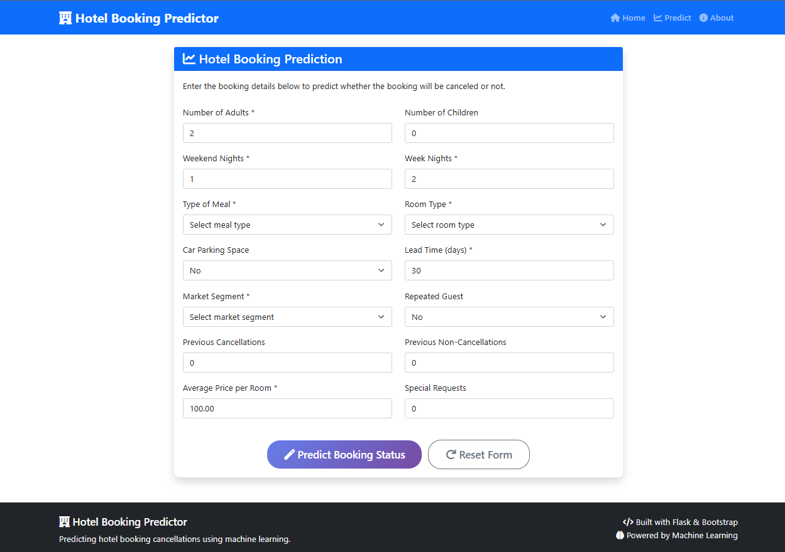

# Hotel Booking Predictor

🚀 **[Try the Live Demo](https://hotel-booking-predictor.onrender.com/predict)** 🚀

A machine learning web application that predicts whether a hotel booking will be canceled or not based on various booking characteristics.

> **Quick Start**: Visit the [live web application](https://hotel-booking-predictor.onrender.com/predict) to start making predictions immediately!

## 📱 Web Application Preview

### Home Page


### Prediction Interface


## 🔗 Live Application Links

- 🎯 **[Make Predictions](https://hotel-booking-predictor.onrender.com/predict)** - Main prediction interface
- 🏠 **[Home Page](https://hotel-booking-predictor.onrender.com/)** - Application overview
- ℹ️ **[About](https://hotel-booking-predictor.onrender.com/about)** - Model details and performance metrics
- 🔍 **[API Health](https://hotel-booking-predictor.onrender.com/health)** - System status

## 🎯 Overview

This Flask web application uses advanced machine learning algorithms to analyze hotel booking data and predict cancellation probability. The model has been trained on comprehensive hotel booking data with rigorous preprocessing and feature engineering to achieve high accuracy.

## ✨ Features

- **Real-time Predictions**: Get instant predictions with confidence scores
- **Interactive Web Interface**: User-friendly forms with validation
- **Multiple ML Models**: Supports Random Forest, Gradient Boosting, Logistic Regression, and SVM
- **Comprehensive Analysis**: Detailed insights and recommendations
- **Responsive Design**: Works on desktop, tablet, and mobile devices
- **API Support**: RESTful API for integration with other systems

## 🛠️ Tech Stack

### Backend
- **Framework**: Flask (Python)
- **ML Libraries**: scikit-learn, pandas, numpy
- **Data Processing**: scipy, matplotlib, seaborn

### Frontend
- **Framework**: Bootstrap 5
- **Icons**: Font Awesome
- **JavaScript**: Vanilla JS with modern features

## 📋 Prerequisites

- Python 3.8 or higher
- pip (Python package installer)
- Git (for version control)

## 🚀 Installation & Setup

### 1. Clone the Repository
```bash
git clone <your-repository-url>
cd hotel_booking_predictor
```

### 2. Create Virtual Environment (Recommended)
```bash
# Windows
python -m venv venv
venv\Scripts\activate

# macOS/Linux
python3 -m venv venv
source venv/bin/activate
```

### 3. Install Dependencies
```bash
pip install -r requirements.txt
```

### 4. Extract and Train the Model
```bash
python extract_model.py
```

This step will:
- Load and preprocess the training data
- Train multiple ML models
- Select the best performing model
- Save model artifacts to the `models/` directory

### 5. Run the Application
```bash
python app.py
```

The application will be available at `http://localhost:5000`

## 📁 Project Structure

```
hotel_booking_predictor/
│
├── app.py                 # Main Flask application
├── extract_model.py       # Model training and extraction script
├── requirements.txt       # Python dependencies
├── README.md              # Project documentation
│
├── app/
│   ├── templates/         # HTML templates
│   │   ├── base.html      # Base template
│   │   ├── index.html     # Home page
│   │   ├── predict.html   # Prediction form
│   │   ├── result.html    # Results page
│   │   ├── about.html     # About page
│   │   ├── error.html     # Error page
│   │   ├── 404.html       # 404 error page
│   │   └── 500.html       # 500 error page
│   │
│   └── static/            # Static assets
│       ├── css/
│       │   └── style.css  # Custom styles
│       └── js/
│           └── main.js    # JavaScript functionality
│
└── models/                # Model artifacts (created after training)
    ├── best_model.pkl     # Trained ML model
    ├── scaler.pkl         # Feature scaler
    ├── label_encoder.pkl  # Target encoder
    └── feature_info.pkl   # Feature metadata
```

## 🔍 How It Works

### Data Preprocessing
1. **Data Cleaning**: Handles missing values and removes duplicates
2. **Outlier Detection**: Uses IQR method to identify and remove outliers
3. **Feature Engineering**: Creates new features like total_nights, total_guests, price_per_night
4. **Multicollinearity**: Removes highly correlated features

### Model Training
1. **Algorithms Tested**: Logistic Regression, Random Forest, Gradient Boosting, SVM
2. **Cross-Validation**: Uses stratified train-test split
3. **Feature Scaling**: Applies StandardScaler to numerical features
4. **Categorical Encoding**: Uses one-hot encoding for categorical variables

### Prediction Process
1. User inputs booking details through the web form
2. Data is preprocessed using the same pipeline as training
3. Model makes prediction with confidence score
4. Results are displayed with insights and recommendations

## 📊 Model Performance

The application automatically selects the best performing model based on accuracy. Typical performance metrics:

- **Accuracy**: 85-95% (varies by model)
- **Features Used**: 14 key booking characteristics
- **Prediction Time**: < 100ms

### Data Science Workflow Visualizations

#### Data Preprocessing Pipeline


#### Feature Engineering Process


#### Outlier Analysis


#### Model Development & Selection


#### Core Data Processing Summary


## 🌐 API Usage

### Prediction Endpoint

**POST** `/api/predict`

**Request Body:**
```json
{
    "number_of_adults": 2,
    "number_of_children": 0,
    "number_of_weekend_nights": 1,
    "number_of_week_nights": 2,
    "type_of_meal": "Meal Plan 1",
    "car_parking_space": 0,
    "room_type": "Room_Type 1",
    "lead_time": 30,
    "market_segment_type": "Online",
    "repeated": 0,
    "P-C": 0,
    "P-not-C": 0,
    "average_price": 100.0,
    "special_requests": 1
}
```

**Response:**
```json
{
    "prediction": "Not_Canceled",
    "confidence": 0.85,
    "probabilities": {
        "canceled": 0.15,
        "not_canceled": 0.85
    },
    "model_info": {
        "name": "Random Forest",
        "accuracy": 0.92
    }
}
```

## 🔧 Configuration

### Environment Variables
Create a `.env` file for production:

```env
FLASK_ENV=production
SECRET_KEY=your-secret-key-here
DEBUG=False
```

### Model Configuration
Modify `extract_model.py` to:
- Change model parameters
- Add new algorithms
- Adjust preprocessing steps

## 🚀 Deployment

### Local Development
```bash
python app.py
```

### Production with Gunicorn
```bash
gunicorn -w 4 -b 0.0.0.0:8000 app:app
```

### Docker Deployment
```dockerfile
FROM python:3.9-slim

WORKDIR /app
COPY requirements.txt .
RUN pip install -r requirements.txt

COPY . .
EXPOSE 5000

CMD ["python", "app.py"]
```

## � Deployment

### Deploy to Render (Recommended)

This application is optimized for deployment on [Render.com](https://render.com), which provides excellent support for Python Flask applications.

#### Step-by-Step Deployment:

1. **Connect Repository**:
   - Go to [render.com](https://render.com) and sign up/login
   - Click **"New +"** → **"Web Service"**
   - Connect your GitHub repository: `moazmo/hotel-booking-predictor`

2. **Configure Service Settings**:
   - **Name**: `hotel-booking-predictor`
   - **Runtime**: `Python 3`
   - **Region**: Choose your preferred region
   - **Branch**: `master`
   - **Root Directory**: Leave empty (use root)

3. **Build & Deploy Commands**:
   - **Build Command**: `pip install -r requirements.txt`
   - **Start Command**: `python extract_model.py && gunicorn --bind 0.0.0.0:$PORT app:app`

4. **Environment Variables** (Optional but recommended):
   - Click **"Advanced"** → **"Add Environment Variable"**
   - Add: `SECRET_KEY` = `your-secret-key-here` (generate a secure random string)
   - Add: `PYTHON_VERSION` = `3.11.0`

5. **Deploy**:
   - Click **"Create Web Service"**
   - Render will automatically build and deploy your app
   - Wait 5-10 minutes for the build to complete

#### 🔧 Alternative Commands (if above fails):

**Option 1**: Separate model creation
- **Build Command**: `pip install -r requirements.txt && python extract_model.py`
- **Start Command**: `gunicorn --bind 0.0.0.0:$PORT app:app`

**Option 2**: Simple approach
- **Build Command**: `pip install -r requirements.txt`
- **Start Command**: `gunicorn --bind 0.0.0.0:$PORT app:app`
  
(Models will be created on first prediction request)

#### Alternative: Using render.yaml

This repository includes a `render.yaml` file for automated deployment:

```yaml
services:
  - type: web
    name: hotel-booking-predictor
    runtime: python
    buildCommand: "pip install -r requirements.txt && python extract_model.py"
    startCommand: "gunicorn --bind 0.0.0.0:$PORT app:app"
    envVars:
      - key: PYTHON_VERSION
        value: 3.11.0
      - key: SECRET_KEY
        generateValue: true
```

#### Features on Render:
- ✅ **Free Tier Available**: Perfect for testing and demos
- ✅ **Automatic HTTPS**: Secure connections out of the box
- ✅ **Custom Domains**: Add your own domain name
- ✅ **Auto-Deploy**: Automatic deployments from GitHub
- ✅ **Health Checks**: Built-in monitoring at `/health`

#### Post-Deployment:
- Your app will be available at: `https://hotel-booking-predictor.onrender.com`
- Health check endpoint: `https://hotel-booking-predictor.onrender.com/health`
- API endpoint: `https://hotel-booking-predictor.onrender.com/api/predict`

### Alternative Deployment Options

#### Railway (Alternative)
- Similar to Render with excellent Python support
- Use the included `Procfile` and `start.sh`

#### Heroku
- Classic PaaS platform
- Use the `Procfile` for deployment configuration

#### Docker
Use the included Dockerfile for containerized deployment on any platform.

## �📝 Usage Instructions

1. **Navigate to Home**: Open the application in your browser
2. **Click Predict**: Go to the prediction page
3. **Fill Form**: Enter all required booking details
4. **Submit**: Click "Predict Booking Status"
5. **View Results**: Review prediction, confidence, and insights
6. **Take Action**: Use recommendations for decision making

## 🤝 Contributing

1. Fork the repository
2. Create a feature branch (`git checkout -b feature/AmazingFeature`)
3. Commit your changes (`git commit -m 'Add some AmazingFeature'`)
4. Push to the branch (`git push origin feature/AmazingFeature`)
5. Open a Pull Request

## 📄 License

This project is licensed under the MIT License - see the [LICENSE](LICENSE) file for details.

## ⚠️ Disclaimer

This machine learning model is designed to assist in decision-making but should not be the sole factor in business decisions. The predictions are based on historical data patterns and may not account for all real-world variables.

## 📞 Support

If you encounter any issues or have questions:

1. Check the [Issues](../../issues) page
2. Create a new issue with detailed description
3. Include error logs and reproduction steps

## 🙏 Acknowledgments

- Dataset source: Hotel booking dataset
- Built with Flask and scikit-learn
- UI components from Bootstrap
- Icons from Font Awesome

---

**Made with ❤️ for hotel industry automation**
